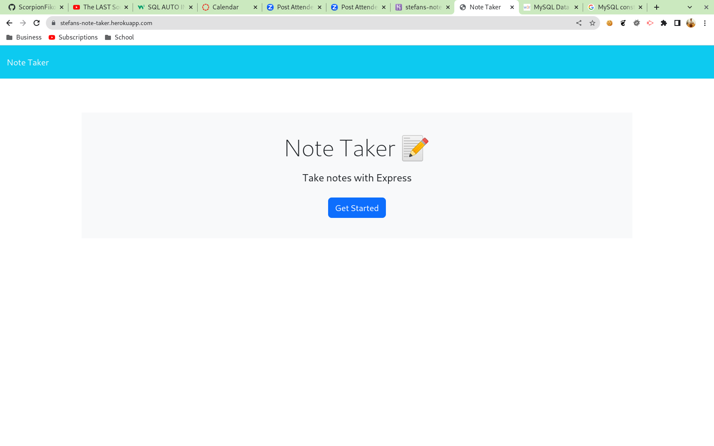
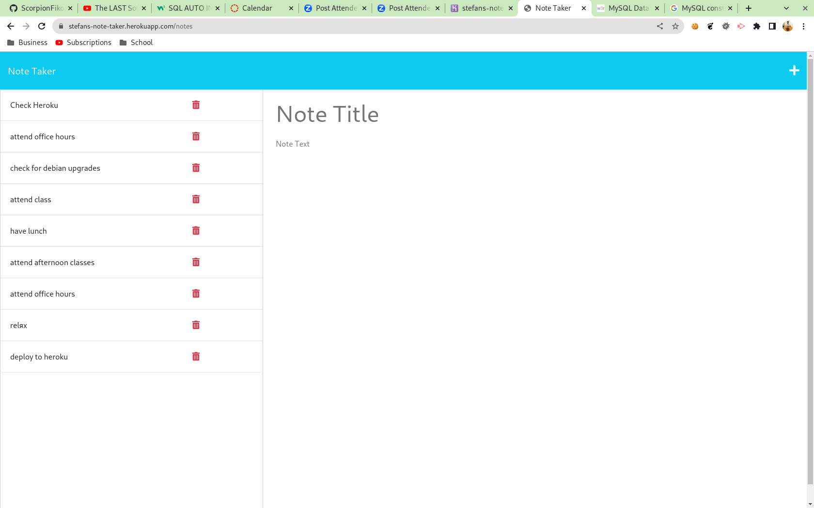
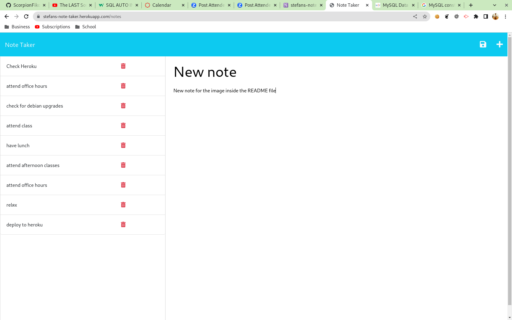
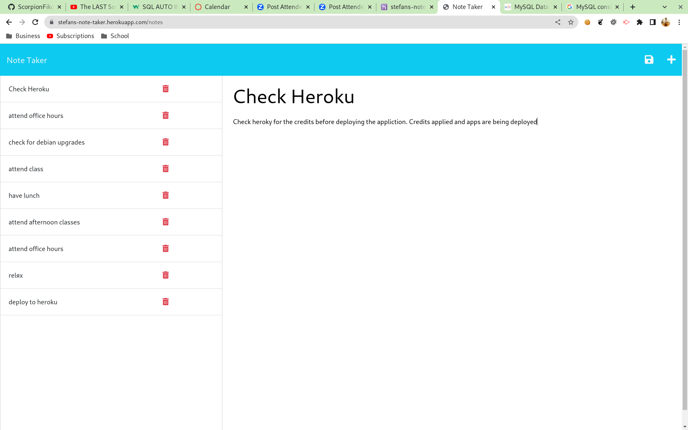

# UTOR-MOD11-CHAL01-Note-Taker
University of Toronto - Module 11 - Challenge 01 - Note Taker

## Description

Repository containing the code for the Note Taker application. This is an application that lets the user 
- ADD new notes: a title and body are required before saving
- UPDATE existing note: changes to the title or body are required before saving the updates
- DELETE existing notes: no prerequisites needed. 

The existing notes are displayed on the left side of the screen and clicking on them, will result in the clicked note being displayed in the centre where it can be edited and saved again. The user can provide as little or as much information of the note, the one caveat is that the title of the note can not exceed more than 28 characters. 

The application is made up of two separate html pages
- landing page: when the application is accessed or when a non existing URL is requested
- notes page: where the user can create, update, or delete notes

Below is the image of the application when the user lands on the page

Below is the image of the notes page with pre-existing notes list

Below is the image of the notes page with pre-existing notes list and user adds a new note:

Below is the image of the notes page with pre-existing notes list and user edits an existing note:

## Table of Contents

- [Installation](#installation)
- [Functionality](#functionality)
- [Usage](#usage)
- [Credits](#credits)
- [License](#license)

## Installation

No special installation requirements are needed. Visit https://stefans-note-taker.herokuapp.com/ to access the web application.

## Functionality

The following discusses at a high level about some of the features of the website. Detailed code implementation can be found as comments in the JS files.

### Node.js with Express.js server:

The entire server side of the porject is built on Node.js with Express.js. Along with that, routes have been used for scalability purposes. File manipulations have been done using the fs library. 

The application accesses and writes information to the following directory:

        /application_folder/db/db.json

This file is considered the data storage for the application until moved to a database.

### Bootstrap:

The front end of the application is done using Bootstrap. The website is fully responsive although on devices under 400px width, the note list can be moved to a hidden menu

### Note Editing:

The original functionality of the application had a limit of not editing notes. This limitation has been removed and the user now can edit any existing notes. The order of the notes is also preserved. Codes in the comment explain what was done on the original code in order to ensure the update functionality works.

## Usage

For accessing the application: 

- go to https://stefans-note-taker.herokuapp.com/
- click on the "get started" button
- to add a note:
    - enter title
    - enter text
    - click on the save icon on the top right corner
- to edit a note:
    - click on the existing note
    - update the title or the text
    - click on the save icon on the top right corner
- to delete a note:
    - click on the garbage can icon beside the note

For viewing the responsiveness of the website: 
Method 1:
- Use separate computer, tablet, or phone to access the website

Method 2:
- Access the web page via web browser.
- Right click on the page and select "inspect" to open browser's developer tools
- Enable the device toolbar if not already enabled
- Use the device toolbar on the right to grow or shrink the viewable area and see how items change

## Credits

N/A

## License

Please refer to the LICENSE in the repo.

## Future Development

These are some ideas about future development:
1. Create "note menu" for devices under 400px in screen width
2. Add days so that the user can access different notes for different calendar days
3. Add a way to prioritize the tasks either based on importance or time sequence

